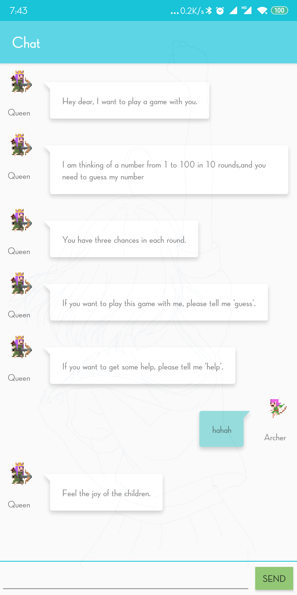
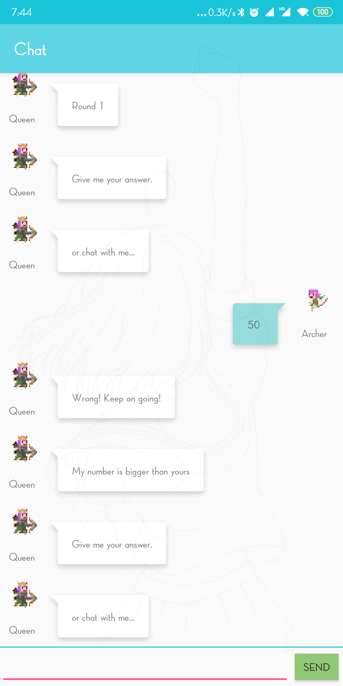
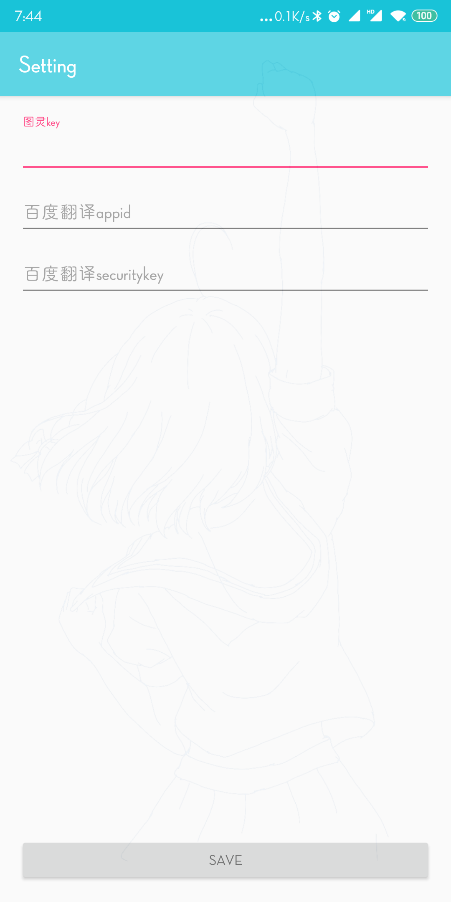

# BotChat

好久之前为了学英语(并没有)做的Android聊天机器人, 调用 图灵接口(调用百度翻译接口进行英文会话)

需要配置图灵api, 百度翻译api

cn.mirakyux.botchat.util.Constant

> TULING_KEY
>
> BAIDU_APPID
>
> BAIDU_SECURITY_KEY

申请自己的[图灵api](http://www.turingapi.com/)

申请自己的[百度翻译api](http://api.fanyi.baidu.com/api/trans/product/prodinfo)

